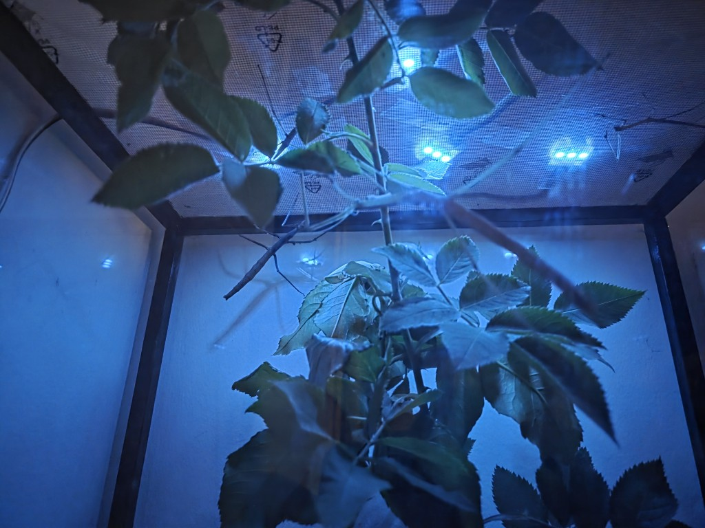
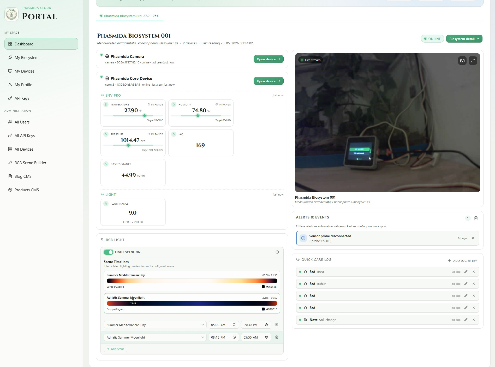

# Phasmida Firmware Core

> Source-available firmware that turns an ESP32 + M5Stack into a real-time monitoring brain for your bioactive terrarium. Free for hobby, personal and noncommercial use. Built by makers, for makers — where entomology meets IoT.

<p align="center">
  
  
</p>

<p align="center">
  
  
  
  
  
  
</p>

---

Keeping stick insects, mantises, isopods, beetles, geckos or any other bioactive habitat? **Phasmida Firmware Core** gives you a production-grade, hackable firmware that watches your enclosure 24/7 — temperature, humidity, light, soil moisture, even a live camera feed — and streams it all to a cloud dashboard you can open from anywhere.

No cloud lock-in tax. No paywalls to read your own sensor data. Just flash, connect, and watch your terrarium come alive in real time.

## ✨ What you get out of the box

- 🌡️ **Real-time climate telemetry** — temperature, humidity, pressure, light, soil moisture
- 📷 **Live camera streaming** with quality control for habitat checks and pet-cam moments
- 📡 **MQTT-first architecture** — plug into Home Assistant, Node-RED, n8n, or any broker you like
- 🖥️ **On-device UI** on the CoreS3 touchscreen (no laptop required to see what's going on)
- ☁️ **Free cloud dashboard** at [phasmida.eu](https://www.phasmida.eu) — zero backend code to write
- 🔌 **Modular probes** — drop in a new sensor by implementing one interface
- 🔐 **Secrets stay local** — public-safe defaults + machine-local `secrets.local.h` overrides

## 🔩 Hardware this firmware speaks to

This project is built for **ESP32-class microcontrollers** and **M5Stack** hardware modules. If you're searching for firmware for any of these, you're in the right place:

**Boards / MCUs**

- M5Stack **CoreS3** (ESP32-S3) — main sensor hub with touchscreen UI
- M5Stack **Timer Camera F** (ESP32 + OV3660) — camera streaming node
- Generic **ESP32** / **ESP32-S3** dev boards (with adjustment)

**Environmental sensors**

- **DHT22** / AM2302 — temperature + humidity
- **M5Stack ENV III** (SHT30 + QMP6988) — temperature, humidity, pressure
- **M5Stack ENV Pro** (BME688) — temperature, humidity, pressure, gas/IAQ
- **M5Stack DLight** (BH1750) — ambient light (lux)
- **Capacitive soil moisture probes**
- **WS2812 / RGB LED** strips for grow light verification

Keywords for the search engines: *ESP32 terrarium monitor, M5Stack CoreS3 firmware, M5Stack Timer Camera firmware, DHT22 ESP32, ENV III sensor, bioactive vivarium IoT, reptile terrarium monitoring, insect keeping IoT, MQTT terrarium, PlatformIO ESP32 project.*

## 🎯 Device targets

Two PlatformIO environments, one shared codebase:

| Target              | Hardware                  | Role                                         |
| ------------------- | ------------------------- | -------------------------------------------- |
| `core_s3` (default) | M5Stack CoreS3 (ESP32-S3) | Sensor hub: UI + probes + MQTT publishing    |
| `timer_camera_f`    | M5Stack Timer Camera F    | Camera streaming + image quality control     |

Build system: **PlatformIO**.

## ☁️ Cloud Integration & Frontend

Here's the part that usually takes weeks of backend work — **and it's already done for you**.

This firmware ships pre-wired to talk to the **Phasmida Smart Cloud API**. The API *and* the frontend dashboard are **completely ready to use**, so you can go from "box of parts on the desk" to "live charts on your phone" in a single afternoon.

- 🚀 **No backend to build** — telemetry endpoint, storage, auth and charts are all hosted
- 🆓 **Free API key** — generate one from your account and paste it into `secrets.local.h`
- 📊 **Live dashboard** — historical graphs, current readings, multi-device overview
- 🌍 **Access from anywhere** — open your terrarium dashboard from any browser

👉 **Get your free API key and start monitoring:** [www.phasmida.eu](https://www.phasmida.eu)

Prefer to self-host? The MQTT protocol is fully documented in [`docs/MQTT-PROTOCOL-v1.md`](docs/MQTT-PROTOCOL-v1.md) so you can point the firmware at your own broker any time.

## Repository layout

```text
include/                 Shared headers and compile-time config
src/core_s3/             CoreS3 firmware sources
src/timer_camera/        Timer Camera firmware sources
src/shared/              Shared implementation (Wi-Fi, time sync, identity)
docs/                    Protocol and product docs
tools/                   Local helper scripts
platformio.ini           PlatformIO environments
```

## Prerequisites

- VS Code with PlatformIO extension
- Python 3.10+ (for helper scripts)
- USB drivers for your board (COM port visibility)

Optional but recommended:

- serial terminal (PlatformIO monitor or equivalent)
- MQTT broker access for runtime validation

## Quick start

1. Clone the repository.
2. Create local secrets override file:

```powershell
Copy-Item include\secrets.example.h include\secrets.local.h
```

3. Edit `include\secrets.local.h` and set private values (never commit this file):

```c
#pragma once

#define PHASMIDA_CORE_DEVICE_API_KEY "<core-device-api-key>"

#define PHASMIDA_CAM_DEVICE_API_KEY "<camera-device-api-key>"
```

4. Build firmware.

## First-time setup checklist

1. Verify `platformio.ini` COM ports for your machine.
2. Confirm `include\secrets.local.h` is present and contains valid API keys.
3. Build at least one target (`core_s3` or `timer_camera_f`).
4. Flash and open serial monitor to confirm clean boot.

## Build commands

PowerShell with bundled PlatformIO executable:

```powershell
$env:USERPROFILE\.platformio\penv\Scripts\platformio.exe run -e core_s3
$env:USERPROFILE\.platformio\penv\Scripts\platformio.exe run -e timer_camera_f
```

Clean build examples:

```powershell
$env:USERPROFILE\.platformio\penv\Scripts\platformio.exe run -e core_s3 -t clean
$env:USERPROFILE\.platformio\penv\Scripts\platformio.exe run -e timer_camera_f -t clean
```

Upload examples:

```powershell
$env:USERPROFILE\.platformio\penv\Scripts\platformio.exe run -e core_s3 -t upload
$env:USERPROFILE\.platformio\penv\Scripts\platformio.exe run -e timer_camera_f -t upload
```

Serial monitor examples:

```powershell
$env:USERPROFILE\.platformio\penv\Scripts\platformio.exe device monitor -e core_s3
$env:USERPROFILE\.platformio\penv\Scripts\platformio.exe device monitor -e timer_camera_f
```

One-command upload + monitor examples:

```powershell
$env:USERPROFILE\.platformio\penv\Scripts\platformio.exe run -e core_s3 -t upload -t monitor
$env:USERPROFILE\.platformio\penv\Scripts\platformio.exe run -e timer_camera_f -t upload -t monitor
```

VS Code task currently included in workspace:

- PlatformIO: Build
- PlatformIO: Build (core_s3)
- PlatformIO: Build (timer_camera_f)

Adjust COM ports in `platformio.ini` for your machine before upload/monitor.

## Runtime configuration model

Configuration precedence is:

1. compile-time local overrides from `include\secrets.local.h`
2. runtime values stored in NVS
3. tracked public-safe defaults from app/camera config headers

This keeps the public repository safe while preserving existing firmware behavior.

Notes:

- `include\secrets.local.h` is intentionally gitignored and machine-local.
- Runtime values in NVS may override some defaults after device provisioning.

## MQTT and protocol

See `docs/MQTT-PROTOCOL-v1.md` for contract and payloads.

Current implementation note: MQTT currently uses plain TCP on port 1883 in firmware.

Integration tip:

- Keep topic naming and payload shape aligned with the protocol doc when adding new telemetry or commands.

## Tools

MQTT camera emulator script no longer ships with embedded credentials.

Use one of:

- `--password`
- `--api-key`
- `PHASMIDA_MQTT_API_KEY` environment variable

Useful scripts in `tools/`:

- `reset_device.py`: reset/provisioning helper utility
- `camera_quality_tuner.py`: assist tuning camera quality parameters
- `jpg_to_header.py`: convert image assets to firmware header format

## Troubleshooting

- Build fails with missing symbols: verify `include\secrets.local.h` exists and macro names are correct.
- Upload fails: check board COM port in `platformio.ini`.
- Provisioning does not start: confirm device has no valid Wi-Fi credentials in NVS.
- Serial monitor shows no output: verify correct `monitor_port` and monitor speed `115200`.
- Build unexpectedly uses wrong target: specify `-e core_s3` or `-e timer_camera_f` explicitly.

## Typical development workflow

1. Update code/config for one target.
2. Run target build.
3. Flash device.
4. Open serial monitor and verify startup logs.
5. Validate MQTT behavior against protocol doc.
6. Repeat for second target when shared code changes.

## Release-safety reminders

- Never commit `include\secrets.local.h`.
- Avoid embedding credentials in scripts or docs.
- Keep protocol or payload changes synchronized with docs.

## Contributing and security

- Contribution guide: `CONTRIBUTING.md`
- Security policy: `SECURITY.md`

## License

This project is released under the **[PolyForm Noncommercial License 1.0.0](LICENSE)**.

**TL;DR (not legal advice — see [LICENSE](LICENSE) for the binding terms):**

- ✅ Free to use, modify, fork, and share for **noncommercial** purposes — hobby projects, personal terrariums, research, education, public-interest organizations.
- ✅ Pull requests and community contributions are welcome.
- ❌ **Commercial use requires a separate license.** That includes paid products, paid services, SaaS, or anything with anticipated commercial application built on top of this firmware.
- 📧 For a commercial license, contact the maintainer via [phasmida.eu](https://www.phasmida.eu) or open an issue on the repo.

## 💬 Community & Support

[](https://discord.gg/p3V7bFHxs)

If you get stuck flashing the microcontroller, have ideas for new features, or just want to show off your bioactive setups, feel free to drop by our Discord!

We love seeing photos of your stick insects, mantises, isopods and the rest of the gang — bring your build, bring your bugs. 🐛🦗🦂

---

<sub>Made with ❤️ at the intersection of entomology and IoT. If this project helps your critters thrive, consider giving the repo a ⭐ — it genuinely helps other keepers find it.</sub>
